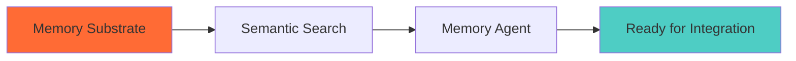
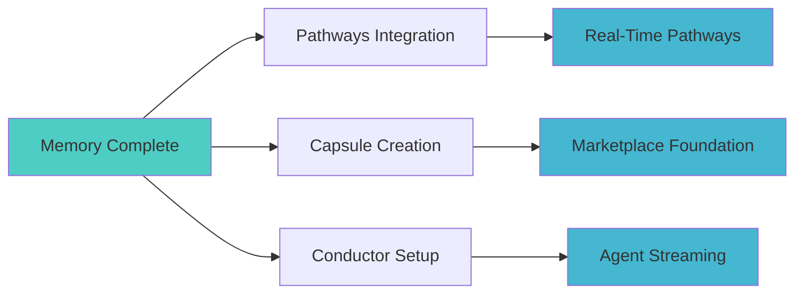
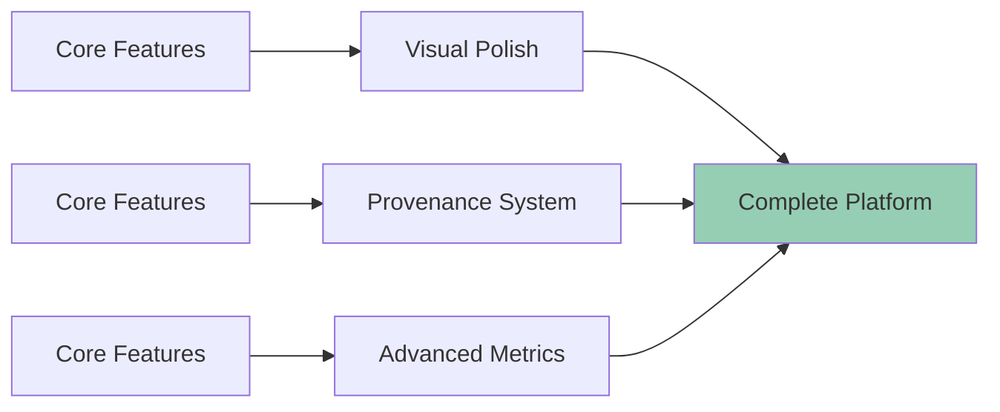

# 📋 IMPLEMENTATION COORDINATION INDEX (TD-2025-009)

## **🎯 MASTER BLUEPRINT OVERVIEW**

This coordination guide ensures parallel development teams can work efficiently on the Eco ecosystem while maintaining integration integrity.

---

## **📂 BLUEPRINT STRUCTURE**

### **Core Foundation Blueprints:**

1. **[01-MEMORY-CONVERGENCE.md](./01-MEMORY-CONVERGENCE.md)** — *Memory as Substrate*
   - **Commits:** 28-29 (Memory as Substrate, Semantic Search & Memory Agent)
   - **Priority:** **CRITICAL PATH** — Must be completed first
   - **Team:** Memory/Backend Team
   - **Duration:** 2-3 sprints

2. **[02-PATHWAYS-MEMORY-FUSION.md](./02-PATHWAYS-MEMORY-FUSION.md)** — *Pathways Integration*
   - **Commits:** 30-32 (Pathways-Memory Fusion, Real-Time Streaming, Provenance Ceremonies)
   - **Priority:** High — Depends on Memory completion
   - **Team:** Frontend/UX Team + Memory Team
   - **Duration:** 2 sprints

3. **[03-CAPSULE-ECOSYSTEM.md](./03-CAPSULE-ECOSYSTEM.md)** — *Marketplace Foundation*
   - **Commits:** 33-35 (Capsule Creation, Marketplace Foundation, Live Streaming)
   - **Priority:** High — Can proceed parallel with Pathways
   - **Team:** Marketplace/DevOps Team
   - **Duration:** 3 sprints

### **Platform Enhancement Blueprints:**

4. **[04-VISUAL-PRIMITIVES.md](./04-VISUAL-PRIMITIVES.md)** — *UI Design System*
   - **Commits:** 36-38 (Neon-Glass Icons, Visual Primitives, Storybook Gallery)
   - **Priority:** Medium — Can proceed in parallel
   - **Team:** Design System Team
   - **Duration:** 2 sprints

5. **[05-CONDUCTOR-STREAMING.md](./05-CONDUCTOR-STREAMING.md)** — *Real-Time Infrastructure*
   - **Commits:** 39-42 (Conductor Core, Agent Streaming, UI Integration, Metrics)
   - **Priority:** High — Critical for real-time features
   - **Team:** Backend/Infrastructure Team
   - **Duration:** 3 sprints

6. **[06-PROVENANCE-DEPLOYMENT.md](./06-PROVENANCE-DEPLOYMENT.md)** — *Quality & Security*
   - **Commits:** 43-44 (Gold Hat Ritual, Deployment Integration)
   - **Priority:** Medium — Enhances platform but not blocking
   - **Team:** Security/DevOps Team
   - **Duration:** 2 sprints

---

## **⚡ CRITICAL PATH ANALYSIS**

### **Phase 1: Foundation (Sprints 1-3)**

**Critical:** Memory Convergence (Blueprint #1) must be **100% complete** before other teams can integrate.

### **Phase 2: Core Integration (Sprints 3-6)**

**Parallel Work:** Teams can work simultaneously on Pathways, Capsules, and Conductor once Memory is ready.

### **Phase 3: Enhancement (Sprints 5-8)**

**Polish Phase:** Visual primitives and provenance can be developed while core features stabilize.

---

## **👥 TEAM COORDINATION**

### **Memory/Backend Team** (Critical Path)
- **Primary:** Memory Convergence (Blueprint #1)
- **Secondary:** Conductor backend (Blueprint #5, Commits 39-40)
- **Handoff Points:** 
  - Memory substrate ready → Signal to all teams
  - Database schemas finalized → Frontend teams can begin

### **Frontend/UX Team**
- **Primary:** Pathways-Memory Fusion (Blueprint #2)
- **Secondary:** Visual Primitives (Blueprint #4)
- **Dependencies:** Waits for Memory Team completion
- **Parallel Work:** Can develop Visual Primitives independently

### **Marketplace/DevOps Team**
- **Primary:** Capsule Ecosystem (Blueprint #3)
- **Secondary:** Deployment Infrastructure (Blueprint #6, Commit 44)
- **Dependencies:** Waits for Memory substrate
- **Parallel Work:** Kubernetes configs and deployment pipelines

### **Infrastructure Team**
- **Primary:** Conductor Streaming (Blueprint #5)
- **Secondary:** System Metrics (Blueprint #5, Commit 42)
- **Dependencies:** Basic Memory API endpoints
- **Parallel Work:** WebSocket infrastructure setup

### **Design System Team**
- **Primary:** Visual Primitives (Blueprint #4)
- **Secondary:** Storybook Gallery (Blueprint #4, Commit 38)
- **Dependencies:** None — fully independent
- **Deliverables:** Component library for all other teams

### **Security/DevOps Team**
- **Primary:** Provenance System (Blueprint #6)
- **Secondary:** Deployment Integration (Blueprint #6, Commit 44)
- **Dependencies:** Capsule creation workflow
- **Parallel Work:** Security policies and ceremony infrastructure

---

## **🔗 INTEGRATION CHECKPOINTS**

### **Checkpoint 1: Memory Foundation** *(End of Sprint 3)*
**Required Deliverables:**
- [ ] Memory nodes/edges database schema deployed
- [ ] pgvector semantic search functional
- [ ] Basic CRUD API endpoints tested
- [ ] D3.js mindmap rendering working

**Go/No-Go Criteria:**
- Memory Agent can create and link nodes ✅
- Semantic search returns relevant results ✅
- Mindmap visualizes memory graph ✅

**Team Signoffs Required:** Memory Team → All other teams

---

### **Checkpoint 2: Core Integration** *(End of Sprint 6)*
**Required Deliverables:**
- [ ] Pathways can create memory-linked workflows
- [ ] Capsules can reference memory nodes
- [ ] Conductor streams real-time events
- [ ] Basic marketplace functionality

**Go/No-Go Criteria:**
- End-to-end user journey works ✅
- Real-time updates functional ✅
- Cross-domain linking operational ✅

**Team Signoffs Required:** All core teams

---

### **Checkpoint 3: Platform Ready** *(End of Sprint 8)*
**Required Deliverables:**
- [ ] Visual primitives implemented across all apps
- [ ] Provenance ceremonies functional
- [ ] Deployment automation complete
- [ ] Comprehensive monitoring active

**Go/No-Go Criteria:**
- Production deployment successful ✅
- User acceptance testing passed ✅
- Performance benchmarks met ✅

**Team Signoffs Required:** All teams + Product Owner

---

## **📊 SUCCESS METRICS**

### **Phase 1 Metrics: Foundation**
- Memory node creation latency < 100ms
- Semantic search results relevance > 80%
- Mindmap rendering performance > 60fps
- Database query performance < 50ms

### **Phase 2 Metrics: Integration**
- Cross-domain link creation success rate > 95%
- Real-time event delivery latency < 200ms
- Pathway completion rate > 85%
- Marketplace listing time < 5 minutes

### **Phase 3 Metrics: Enhancement**
- Component reuse rate > 80% (Visual Primitives)
- Provenance ceremony completion rate > 70%
- Deployment success rate > 98%
- Platform uptime > 99.5%

---

## **🚨 RISK MITIGATION**

### **High-Risk Dependencies**
1. **Memory Team Blocking:** If Memory team falls behind, all other teams are blocked
   - **Mitigation:** Memory team gets priority resources and daily standups
   - **Fallback:** Simplified memory system with basic CRUD only

2. **Integration Complexity:** Cross-team integration points may have unexpected issues
   - **Mitigation:** Early integration testing with mock services
   - **Fallback:** Feature flags to disable complex integrations

3. **Performance at Scale:** Real-time streaming may not perform at scale
   - **Mitigation:** Load testing throughout development
   - **Fallback:** Polling-based updates instead of real-time

### **Communication Protocols**
- **Daily:** Slack updates in #eco-development channel
- **Weekly:** Cross-team sync meetings every Wednesday
- **Sprints:** Demo all integration points during sprint reviews
- **Blockers:** Immediate escalation via @channel mentions

---

## **🎯 DELIVERY TIMELINE**

| Sprint | Week | Milestone | Teams |
|--------|------|-----------|-------|
| 1-3 | 1-6 | Memory Foundation Complete | Memory/Backend |
| 3-4 | 5-8 | Pathways Integration | Frontend/UX + Memory |
| 3-5 | 5-10 | Capsule Ecosystem | Marketplace/DevOps + Memory |
| 4-6 | 7-12 | Conductor Streaming | Infrastructure + All |
| 2-4 | 3-8 | Visual Primitives | Design System |
| 6-8 | 11-16 | Provenance System | Security/DevOps |

**Target:** Full platform MVP ready by **Week 16** (4 months)

---

## **📞 EMERGENCY CONTACTS**

### **Technical Leads**
- **Memory Team Lead:** [Contact Info]
- **Frontend Team Lead:** [Contact Info]
- **Infrastructure Lead:** [Contact Info]
- **DevOps Lead:** [Contact Info]

### **Escalation Path**
1. **Daily Issues:** Team lead discussion
2. **Sprint Blockers:** Cross-team lead meeting
3. **Critical Path Issues:** Product Owner + CTO involvement
4. **Release Blockers:** Full leadership team escalation

---

**This coordination index ensures every team knows exactly what to build, when to build it, and how their work connects to the larger Eco ecosystem vision.** 🎯⚡

*Last Updated: Blueprint Creation Date*  
*Next Review: Weekly Wednesday Sync*